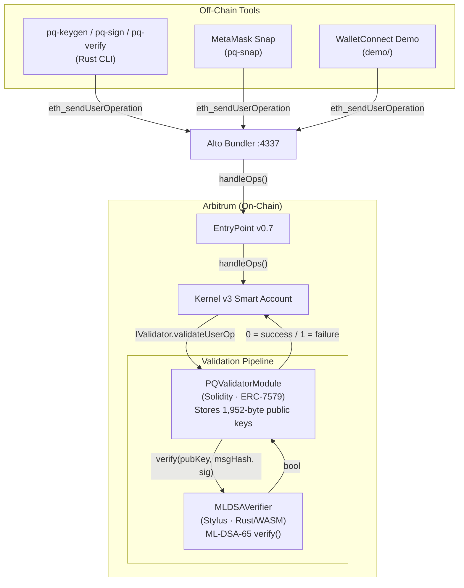

# Post-Quantum Smart Wallet

> **Status: Proof of Concept / Unaudited** — Not for production use. See [Production Limitations](#production-limitations).

A post-quantum secure smart wallet for EVM chains. Uses [ML-DSA](https://csrc.nist.gov/pubs/fips/204/final) (FIPS 204, formerly Dilithium) signatures on [Arbitrum Stylus](https://docs.arbitrum.io/stylus) to protect assets against future quantum computing threats — no protocol changes, no new chains, no hard forks.

## Architecture



**Three-layer design:**

1. **Off-chain tools** — ML-DSA key generation, signing, and UserOp submission (Rust CLI, MetaMask Snap, WalletConnect demo)
2. **Solidity validator module** — ERC-7579 compliant, stores public keys, routes verification calls
3. **Stylus verifier** — ML-DSA-65 signature verification in Rust/WASM at 10-100x lower cost than pure EVM

## Component Map

| Directory | Language | What It Does | README |
|-----------|----------|-------------|--------|
| [`pq-validator/`](pq-validator/) | Rust | ML-DSA-65 Stylus verifier contract (~374K gas) | [pq-validator/README.md](pq-validator/README.md) |
| [`evm/`](evm/) | Solidity | ERC-7579 validator module (Kernel/Safe/Rhinestone compatible) | [evm/README.md](evm/README.md) |
| [`scripts/`](scripts/) | Bash + Rust | Dev stack automation + CLI tools (pq-keygen, pq-sign, pq-verify) | [scripts/README.md](scripts/README.md) |
| [`demo/`](demo/) | TypeScript | WalletConnect dapp + PQ wallet (full E2E signing flow) | [demo/README.md](demo/README.md) |
| [`pq-snap/`](pq-snap/) | TypeScript | MetaMask Snap for ML-DSA key management and signing | [pq-snap/README.md](pq-snap/README.md) |
| [`docs/`](docs/) | Markdown | LOCAL_DEV_GUIDE, research docs, wallet comparison | — |

## Quick Start

For deployment modes (`snap`, `basic-web-wallet`, `cli-e2e`), see [DEPLOYMENT.md](DEPLOYMENT.md).

### Prerequisites

- [Docker](https://www.docker.com/) (for Nitro devnode)
- [Foundry](https://getfoundry.sh/) (`forge`, `cast`)
- [Rust](https://rustup.rs/) with `wasm32-unknown-unknown` target
- [cargo-stylus](https://github.com/OffchainLabs/stylus-sdk-rs) v0.10.0
- Node.js 18+
- External repos at `~/Developer/tools/dlt/`: [nitro-devnode](https://github.com/OffchainLabs/nitro-devnode), [alto](https://github.com/pimlicolabs/alto), [account-abstraction](https://github.com/eth-infinitism/account-abstraction), [kernel](https://github.com/zerodevapp/kernel) (dev branch)

See [docs/LOCAL_DEV_GUIDE.md](docs/LOCAL_DEV_GUIDE.md) for full setup instructions.

### Start the dev stack

```bash
# Spins up Nitro devnode, deploys EntryPoint + Stylus verifier + PQ module, starts Alto bundler
./scripts/dev-stack.sh
```

### Run the E2E test

```bash
# Deploys Kernel, installs PQ validator, signs + submits an ML-DSA UserOp
./scripts/e2e-test.sh
```

### Run unit tests

```bash
# Stylus verifier (4 test cases)
cargo test --package pq-validator

# Solidity module (15 test cases, mocked Stylus)
forge test --root evm/ -vvv
```

## Gas Benchmarks

Measured on local Nitro devnode (2026-02-15). L1 data costs are projections based on Arbitrum mainnet pricing.

### Per-Transaction Costs

| Operation | Gas | Notes |
|-----------|-----|-------|
| ML-DSA-65 verification (Stylus) | 374,000 | Core cryptographic operation |
| Full PQ UserOp (ETH transfer) | 751,312 | End-to-end including Kernel routing |
| Equivalent ECDSA UserOp | 202,816 | Baseline for comparison |
| **PQ overhead** | **3.7x** | vs ECDSA |

### Cost Projection (Arbitrum Mainnet)

| Component | Estimate | Notes |
|-----------|----------|-------|
| L2 execution (751K gas) | ~$0.04 | At 0.05 gwei L2 gas price |
| L1 data posting (~5.5 KB calldata) | $2–8 | Dominant cost; depends on L1 gas price |
| **Total per PQ transaction** | **$2–8** | Within $10 target |

### One-Time Setup Costs

| Operation | Gas |
|-----------|-----|
| Install PQ validator module | ~1,570,000 |
| Grant selector access | ~346,000 |

### Data Sizes

| Property | ECDSA | ML-DSA-65 | Ratio |
|----------|-------|-----------|-------|
| Signature | 65 B | 3,309 B | 51x |
| Public key | 64 B | 1,952 B | 31x |
| WASM binary (gzipped) | — | 7.8 KB | Limit: 24 KB |

## Technology Choices

| Choice | Rationale |
|--------|-----------|
| **ML-DSA-65** (FIPS 204) | NIST-standardized post-quantum signature scheme. Level 3 security (192-bit). Best balance of security and signature size. |
| **Arbitrum Stylus** | Native Rust/WASM execution — ML-DSA verification at 374K gas vs millions in pure EVM. Only viable platform for on-chain lattice crypto today. |
| **`ml-dsa` crate** (RustCrypto) | Faster than `fips204` in benchmarks, active maintenance (Tony Arcieri + Trail of Bits contributors), passes NIST ACVP vectors. See [library comparison](thoughts/shared/research/ml-dsa-library-comparison.md). |
| **ERC-7579 module** | Plug-and-play with existing smart accounts (Kernel, Safe, Rhinestone). No custom account needed. |
| **Kernel v3** | ERC-7579 native, well-maintained by ZeroDev. Full E2E validated on local devnode. |
| **Alto bundler** | Open-source ERC-4337 bundler. Works on Nitro devnode with `--chain-type arbitrum --safe-mode false`. |
| **Stateless Stylus verifier** | Public keys stored in Solidity, passed as calldata. Avoids cross-runtime storage bugs (Nitro #4114) and keeps Stylus contract a pure function. |

## Production Limitations

**This is a proof of concept. It has not been audited and must not be used to secure real assets.**

### Security

- **Unaudited code** — No formal security audit has been performed on any component.
- **RC crate dependency** — The `ml-dsa` crate is v0.1.0-rc.7 (release candidate). API and behavior may change before stable release.
- **Stylus SDK pre-1.0** — Known issues include testing framework segfaults with mappings ([#261](https://github.com/OffchainLabs/stylus-sdk-rs/issues/261)) and cross-contract return data loss ([Nitro #4114](https://github.com/OffchainLabs/nitro/issues/4114)). OpenZeppelin audit found 2 Critical + 2 High issues in the SDK (Aug 2024).

### Cost

- **50x signature size vs ECDSA** — ML-DSA-65 signatures are 3,309 bytes vs 65 bytes. On Arbitrum, L1 data posting is the dominant expense ($2–8 per transaction vs cents for ECDSA). This is an inherent trade-off of post-quantum security.

### Operational

- **Stylus reactivation required** — Contracts auto-deactivate after 365 days or after ArbOS upgrades. Must be reactivated or redeployed. No monitoring or alerting is built.
- **Immutable verifier address** — Upgrading the Stylus verifier requires deploying a new Solidity module and migrating all accounts. No proxy pattern.

### Missing Features

- **No key rotation** — Public key can only be changed by uninstalling and reinstalling the module.
- **No sender allowlist** — `isValidSignatureWithSender` accepts any sender.
- **No signature aggregation** — Single-validator, non-aggregated path only.
- **No paymaster support** — Demo requires pre-funded smart accounts.
- **Wallet UX not production-ready** — Snap requires Flask (developer build), and the demo wallet currently relies on manual browser seed entry for signing.

### Testing Gaps

- **Bundler compatibility untested beyond Alto** — Not tested with Pimlico, Alchemy, Stackup, or other production bundlers. ERC-7562 storage access rules not validated.
- **No Sepolia/mainnet deployment** — All measurements on local devnode with zero L1 fees. Real-world gas costs are projections only.
- **Mock-based Solidity tests** — Unit tests stub Stylus calls with `vm.mockCall`. Integration testing requires a running devnode.

## References

**Standards:**
- [FIPS 204 — ML-DSA](https://csrc.nist.gov/pubs/fips/204/final) (signature scheme)
- [ERC-7579 — Modular Smart Accounts](https://eips.ethereum.org/EIPS/eip-7579)
- [ERC-4337 — Account Abstraction](https://eips.ethereum.org/EIPS/eip-4337)

**Platform:**
- [Arbitrum Stylus Documentation](https://docs.arbitrum.io/stylus)
- [stylus-sdk-rs](https://github.com/OffchainLabs/stylus-sdk-rs) (SDK + cargo-stylus)

**Project Docs:**
- [Design Document](design_doc.md) — Full architecture, decisions, security boundaries, implementation status
- [Local Dev Guide](docs/LOCAL_DEV_GUIDE.md) — Setup, workflows, Kernel v3 integration, troubleshooting
- [ML-DSA Library Comparison](thoughts/shared/research/ml-dsa-library-comparison.md) — 10 crates evaluated
- [Stylus Maturity Assessment](thoughts/shared/research/stylus-maturity-assessment.md) — Platform risk analysis
- [Kernel Integration Assessment](thoughts/shared/research/kernel-local-deployment-assessment.md) — E2E spike results
