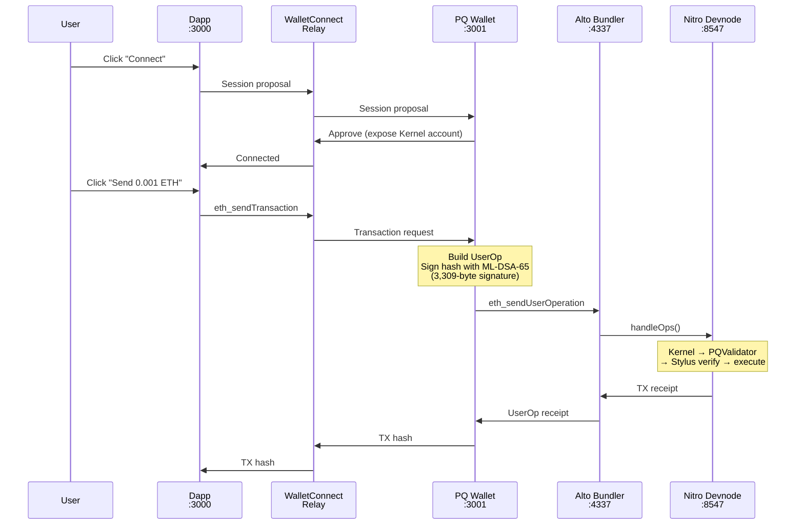

# demo

WalletConnect demo showing post-quantum transaction signing end-to-end. A dapp requests a transaction, a PQ wallet signs it with ML-DSA-65, wraps it as an ERC-4337 UserOp, and submits to the Alto bundler for on-chain execution.

Two apps: **dapp** (port 3000) sends transactions via WalletConnect, **wallet** (port 3001) receives, signs with ML-DSA-65, and submits.

> **Security warning:** This basic web wallet is a local demo only. It is **not** production-safe key management and must not be used with real funds.

## Architecture



## Quick Start

```bash
# 1. Start local stack (if not already running)
./scripts/dev-stack.sh

# 2. Deploy Kernel + install PQ validator + generate keys
./demo/setup.sh

# 3. Start both apps (two terminals)
cd demo/dapp && npm run dev    # localhost:3000
cd demo/wallet && npm run dev  # localhost:3001

# 4. Use it:
#    - Open localhost:3000, click "Connect Wallet"
#    - Copy the WalletConnect URI
#    - Paste into wallet at localhost:3001
#    - Click "Send ETH" on dapp → approve in wallet
```

## Snap Mode

Use this flow to keep the ML-DSA secret key inside MetaMask Snap instead of pasting a seed.

Prerequisites:
- MetaMask Flask installed in your browser
- Snap served locally on port `8080`

```bash
# 1. Start local stack
./scripts/dev-stack.sh

# 2. Build and serve the snap
cd pq-snap
npm run build
npm run serve

# 3. Start wallet UI (new terminal)
cd demo/wallet
npm run dev
```

Then in the wallet UI:
1. Switch signer mode to `Snap`
2. Click `Connect MetaMask Snap`
3. Copy the full public key shown in the signer panel

Back in terminal:

```bash
# 4. Run setup using the snap public key
./demo/setup.sh --snap-pubkey 0x<copied_3904_hex_chars>

# 5. Start dapp
cd demo/dapp
npm run dev
```

Final check:
1. Open `localhost:3000`, connect wallet, and send the demo transaction
2. Approve in the wallet
3. Confirm the snap signing dialog appears and the transaction confirms on-chain

## Manual Path

What `setup.sh` does under the hood:

1. Sources `.env.local` (from `dev-stack.sh`) for deployed contract addresses
2. Builds CLI tools (`pq-keygen`, `pq-sign`) if not already built
3. Deploys Kernel v3 stack: implementation, factory, staker, ECDSA validator
4. Creates Kernel account via factory, funds with 1 ETH
5. Uses ML-DSA-65 public key:
   - default: generates local keypair → `demo/.keys/{pk.bin, sk.bin}`
   - snap mode: uses `--snap-pubkey` value (no local secret key generation)
6. Installs PQ validator module on Kernel (ECDSA-signed install UserOp)
7. Writes `demo/.env` with addresses/config (no private seed material)

## App Structure

**dapp/** — Wagmi + Reown AppKit frontend
- Connects to Kernel account via WalletConnect
- Sends `eth_sendTransaction` (hardcoded: 0.001 ETH to `0x1111...1111`)
- Displays TX hash and confirmation

**wallet/** — WalletConnect WalletKit + ML-DSA signer
- Receives transaction proposals from dapp
- Shows approval UI with transaction details
- On approve: builds UserOp → signs with ML-DSA-65 → submits to bundler → polls for receipt

## Key Files

| File | Purpose |
|------|---------|
| `wallet/src/lib/signer.ts` | Derives ML-DSA-65 keypair from seed, signs UserOp hashes |
| `wallet/src/lib/userop.ts` | Builds PackedUserOp: calldata encoding, nonce computation, hash computation |
| `wallet/src/lib/bundler.ts` | Submits UserOps to Alto, polls `eth_getUserOperationReceipt` |
| `wallet/src/config.ts` | WalletKit init, namespace builder (eip155:412346 only) |
| `dapp/src/config.ts` | Wagmi + AppKit setup, custom Nitro devnode chain definition |
| `setup.sh` | Deploys Kernel, installs PQ validator, generates keys, writes .env |

## Environment

`demo/.env` is generated by `setup.sh`:

| Variable | Value |
|----------|-------|
| `VITE_LOCAL_RPC` | `http://127.0.0.1:8547` |
| `VITE_BUNDLER_RPC` | `http://127.0.0.1:4337` |
| `VITE_CHAIN_ID` | `412346` |
| `VITE_ENTRYPOINT` | EntryPoint v0.7 address |
| `VITE_KERNEL_ACCOUNT` | Deployed Kernel account |
| `VITE_PQ_VALIDATOR_MODULE` | PQ module address |
| `VITE_STYLUS_VERIFIER` | Stylus verifier address |
| `VITE_REOWN_PROJECT_ID` | WalletConnect cloud project ID |

Both apps proxy `/rpc` → devnode and `/bundler` → Alto via Vite config to avoid CORS.
Wallet seed is now loaded manually at runtime in the wallet UI from `demo/.keys/sk.bin` (converted to hex), and kept only in memory for the running tab.

## Production Limitations

- **Manual in-browser seed handling**: The wallet requires pasting a raw seed into the browser UI at runtime. It is no longer embedded in the client bundle, but it is still not production-safe key management.
- **Local chain only**: Hardcoded to chain ID 412346 (Nitro devnode). No testnet/mainnet configuration.
- **No paymaster**: Users pay gas directly from Kernel account. Production would use a paymaster for sponsored transactions.
- **Hardcoded demo values**: Recipient (`0x1111...1111`) and amount (0.001 ETH) are hardcoded in the dapp.
- **Single account**: One pre-deployed Kernel account shared across sessions. No account creation flow.
- **WalletConnect relay dependency**: Requires internet access for Reown relay. No local-only pairing option.
