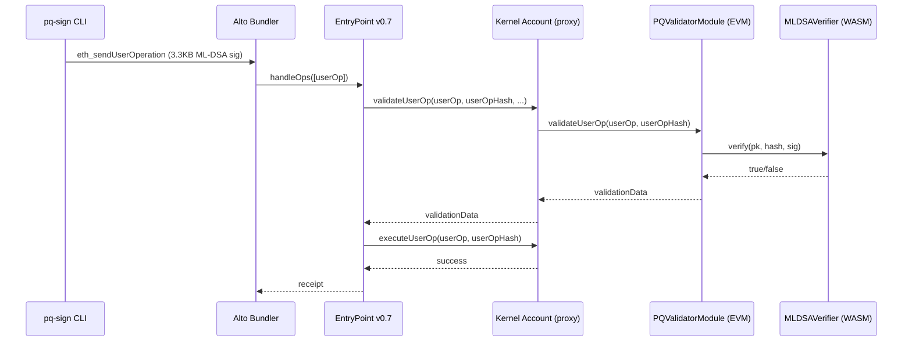

# Local Dev Guide

<!--toc:start-->
- [Local Dev Guide](#local-dev-guide)
  - [Architecture Overview](#architecture-overview)
  - [Prerequisites](#prerequisites)
  - [One-Time Setup](#one-time-setup)
    - [1. Nitro Devnode](#1-nitro-devnode)
    - [2. Alto Bundler](#2-alto-bundler)
    - [3. EntryPoint v0.7 Bytecode](#3-entrypoint-v07-bytecode)
    - [4. Kernel v3 Repository](#4-kernel-v3-repository)
  - [Daily Workflow (Manual)](#daily-workflow-manual)
    - [Stylus Verifier](#stylus-verifier)
    - [Solidity Module](#solidity-module)
    - [Full UserOp Flow](#full-userop-flow)
  - [Daily Workflow (Automated)](#daily-workflow-automated)
  - [Kernel v3 Smart Accounts](#kernel-v3-smart-accounts)
    - [Deploy Infrastructure](#deploy-infrastructure)
    - [Create Account](#create-account)
    - [ECDSA UserOp (Baseline)](#ecdsa-userop-baseline)
  - [PQ Validator Integration](#pq-validator-integration)
    - [CLI Tools](#cli-tools)
    - [Deploy PQ Validator Module](#deploy-pq-validator-module)
    - [Install PQ Validator on Kernel Account](#install-pq-validator-on-kernel-account)
    - [Grant Selector Access](#grant-selector-access)
    - [Nonce Encoding](#nonce-encoding)
    - [Full PQ UserOp Flow](#full-pq-userop-flow)
  - [Gas Reference](#gas-reference)
  - [Troubleshooting](#troubleshooting)
    - [Base Stack](#base-stack)
    - [Kernel-Specific](#kernel-specific)
    - [Debugging Quick Reference](#debugging-quick-reference)
  - [Production Considerations](#production-considerations)
    - [Bundler Simulation of Stylus Calls](#bundler-simulation-of-stylus-calls)
    - [ERC-7562 Storage Access Rules](#erc-7562-storage-access-rules)
    - [L1 Data Cost](#l1-data-cost)
    - [Stylus Activation Lifecycle](#stylus-activation-lifecycle)
<!--toc:end-->

> **Last updated:** 2026-02-15 | Covers: Nitro devnode + Alto bundler + Stylus + Kernel v3 + PQ validator

## Architecture Overview

```
                        ┌──────────────────────────────────────────────┐
                        │         YOUR MACHINE                         │
                        │                                              │
 ┌──────────────────┐   │  ┌────────────────────────────────────────┐  │
 │  Rust CLI Tools  │   │  │  Nitro Devnode (Docker)                │  │
 │                  │   │  │  Port 8547 · Chain ID 412346           │  │
 │  pq-keygen       │   │  │                                        │  │
 │  pq-sign         │   │  │  ┌──────────────────────────────────┐  │  │
 │  pq-verify       │   │  │  │ EVM Runtime                      │  │  │
 │                  │   │  │  │  EntryPoint v0.7                 │  │  │
 │  Generates       │   │  │  │  Kernel (impl + factory + staker)│  │  │
 │  UserOps with    │   │  │  │  ECDSAValidator                  │  │  │
 │  ML-DSA sigs     │   │  │  │  PQValidatorModule ──┐           │  │  │
 └────────┬─────────┘   │  │  │  Kernel Account      │ call      │  │  │
          │             │  │  │   (ERC-1967 proxy)   │           │  │  │
          │ UserOp      │  │  └──────────────────────┼───────────┘  │  │
          │             │  │  ┌──────────────────────▼───────────┐  │  │
          │             │  │  │ Stylus (WASM) Runtime            │  │  │
          ▼             │  │  │  MLDSAVerifier (Rust)            │  │  │
 ┌──────────────────┐   │  │  │   verify(pk, hash, sig) → bool   │  │  │
 │  Alto Bundler    │   │  │  └──────────────────────────────────┘  │  │
 │  Port 4337       │───┼──┤       ▲ RPC (eth_*, debug_*)           │  │
 │                  │   │  └───────┼────────────────────────────────┘  │
 │  Accepts UserOps │   │          │                                   │
 │  Bundles them    │   │  ┌───────┴────────────────────────────────┐  │
 │  Submits to EP   │   │  │  Foundry (cast/forge)                  │  │
 └──────────────────┘   │  │  cargo-stylus                          │  │
                        │  └────────────────────────────────────────┘  │
                        └──────────────────────────────────────────────┘
```



The EVM -> Stylus call is just a normal contract call. Solidity calls the address, Arbitrum routes it to WASM internally. Standard ABI encoding, standard `call`/`staticcall`.

---

## Prerequisites

| Tool | Verify | Notes |
|------|--------|-------|
| Docker | `docker --version` | Runs Nitro devnode + cargo-stylus WASM compilation |
| Rust + WASM target | `rustup target list --installed \| grep wasm` | |
| cargo-stylus | `cargo stylus --version` | 0.10.0+ |
| Foundry (cast/forge) | `cast --version` | |
| Node.js 22.x | `node --version` | For Alto bundler |
| pnpm | `pnpm --version` | For Alto build |

Shell note: zsh profile loads Foundry/cargo paths. If a tool isn't found, open a fresh terminal.

---

## One-Time Setup

### 1. Nitro Devnode

```bash
cd ~/Developer/tools/dlt
git clone https://github.com/OffchainLabs/nitro-devnode.git
```

First run pulls the Docker image (~1GB). Subsequent starts are instant.

### 2. Alto Bundler

```bash
cd ~/Developer/tools/dlt
git clone --depth 1 https://github.com/pimlicolabs/alto.git && cd alto && pnpm install && pnpm run build:all
```

### 3. EntryPoint v0.7 Bytecode

```bash
cd ~/Developer/tools/dlt
git clone --depth 1 --branch v0.7.0 https://github.com/eth-infinitism/account-abstraction.git
cd account-abstraction && npm install --legacy-peer-deps && npx hardhat compile
```

Extract bytecodes:

```bash
node -e "const a = require('./artifacts/contracts/core/EntryPoint.sol/EntryPoint.json'); process.stdout.write(a.bytecode)" > ~/Developer/tools/dlt/entrypoint_v07_bytecode.txt
node -e "const a = require('./artifacts/contracts/samples/SimpleAccountFactory.sol/SimpleAccountFactory.json'); process.stdout.write(a.bytecode)" > ~/Developer/tools/dlt/simple_account_factory_bytecode.txt
```

### 4. Kernel v3 Repository

```bash
git clone https://github.com/zerodev-labs/kernel.git ~/Developer/tools/dlt/kernel
cd ~/Developer/tools/dlt/kernel && git checkout dev && forge install
```

Kernel **must** compile with `via-ir = true` to stay under the 24KB EIP-170 limit. Default build produces ~29KB. Use the `deploy` profile:

```bash
FOUNDRY_PROFILE=deploy forge build
```

---

## Daily Workflow (Manual)

### Stylus Verifier

```bash
# Unit test
cargo test --package pq-validator

# Validate WASM constraints (needs Docker)
cargo stylus check --manifest-path pq-validator/Cargo.toml

# Deploy to devnode
cargo stylus deploy --endpoint='http://127.0.0.1:8547' --private-key='0xb6b15c8cb491557369f3c7d2c287b053eb229daa9c22138887752191c9520659' --no-verify --manifest-path pq-validator/Cargo.toml

# Generate ML-DSA test vectors (sets PK_HEX, MSG_HASH, SIG_HEX in your shell)
eval $(cargo run --bin gen_test_data --manifest-path ml-dsa-test/Cargo.toml 2>/dev/null)

# Verify env vars loaded
echo "${PK_HEX:0:20}..."

# Test deployed contract (replace address with deploy output)
cast call <STYLUS_ADDRESS> "verify(bytes,bytes32,bytes)(bool)" $PK_HEX $MSG_HASH $SIG_HEX --rpc-url http://127.0.0.1:8547

# Estimate verification gas
cast estimate <STYLUS_ADDRESS> "verify(bytes,bytes32,bytes)" $PK_HEX $MSG_HASH $SIG_HEX --rpc-url http://127.0.0.1:8547
```

### Solidity Module

```bash
# Build + test
forge build --root evm
forge test --root evm -vvv

# Test against live devnode (cross-runtime calls hit Stylus)
forge test --root evm --fork-url http://127.0.0.1:8547 -vvv

# Deploy (replace STYLUS_VERIFIER_ADDRESS)
forge create evm/src/PQValidatorModule.sol:PQValidatorModule --rpc-url http://127.0.0.1:8547 --private-key 0xb6b15c8cb491557369f3c7d2c287b053eb229daa9c22138887752191c9520659 --constructor-args <STYLUS_VERIFIER_ADDRESS>

# Smoke test
cast call <MODULE_ADDRESS> "isModuleType(uint256)(bool)" 1 --rpc-url http://127.0.0.1:8547
```

### Full UserOp Flow

```bash
# Check bundler is alive
curl -s http://127.0.0.1:4337 -H "Content-Type: application/json" -d '{"jsonrpc":"2.0","method":"eth_supportedEntryPoints","params":[],"id":1}'

# Send UserOp
curl -s http://127.0.0.1:4337 -H "Content-Type: application/json" -d '{"jsonrpc":"2.0","method":"eth_sendUserOperation","params":[<SIGNED_USEROP_JSON>,"<ENTRYPOINT_ADDRESS>"],"id":1}'

# Get receipt
curl -s http://127.0.0.1:4337 -H "Content-Type: application/json" -d '{"jsonrpc":"2.0","method":"eth_getUserOperationReceipt","params":["<USEROP_HASH>"],"id":1}'
```

---

## Daily Workflow (Automated)

One command starts the base stack — devnode, EntryPoint/Factory deploys, executor funding, and Alto bundler:

```bash
./scripts/dev-stack.sh
```

Ctrl-C to stop. Safe to re-run (cleans stale containers/processes automatically).

In a second terminal, load deployed addresses:

```bash
source .env.local
```

This gives you: `LOCAL_RPC`, `BUNDLER_RPC`, `CHAIN_ID`, `ENTRYPOINT`, `SIMPLE_ACCOUNT_FACTORY`, `DEV_PRIVATE_KEY`.

EntryPoint/Factory addresses change each restart (ephemeral devnode). Your own deploys (Stylus verifier, Solidity module, Kernel infrastructure) need to be set manually:

```bash
export STYLUS_VERIFIER=<deployed address>
export PQ_VALIDATOR=<deployed address>
export KERNEL_ACCOUNT=<deployed address>
```

---

## Kernel v3 Smart Accounts

Kernel v3 provides modular smart accounts (ERC-7579). Each account is an ERC-1967 proxy (61 bytes) pointing to the shared Kernel implementation. Validators are pluggable — a root ECDSA validator comes first, then additional validators (like PQ) are installed as modules.

### Deploy Infrastructure

All Kernel contracts **must** use the `deploy` profile. Order matters: impl -> factory -> staker -> validator.

```bash
export RPC=http://127.0.0.1:8547
export DEV_PK=0xb6b15c8cb491557369f3c7d2c287b053eb229daa9c22138887752191c9520659

cd ~/Developer/tools/dlt/kernel

# 1. Kernel implementation (constructor takes EntryPoint address)
FOUNDRY_PROFILE=deploy forge create src/Kernel.sol:Kernel \
  --rpc-url $RPC --private-key $DEV_PK \
  --constructor-args $ENTRYPOINT
# Gas: ~4,500,000

# 2. KernelFactory (constructor takes Kernel impl address)
FOUNDRY_PROFILE=deploy forge create src/factory/KernelFactory.sol:KernelFactory \
  --rpc-url $RPC --private-key $DEV_PK \
  --constructor-args $KERNEL_IMPL
# Gas: ~800,000

# 3. FactoryStaker (constructor takes owner address)
FOUNDRY_PROFILE=deploy forge create src/factory/FactoryStaker.sol:FactoryStaker \
  --rpc-url $RPC --private-key $DEV_PK \
  --constructor-args $(cast wallet address $DEV_PK)
# Gas: ~600,000

# 4. ECDSAValidator
FOUNDRY_PROFILE=deploy forge create src/validator/ECDSAValidator.sol:ECDSAValidator \
  --rpc-url $RPC --private-key $DEV_PK
# Gas: ~400,000

# 5. Approve factory + stake with EntryPoint (1 ETH, 86400s unstake delay)
cast send $FACTORY_STAKER "approveFactory(address,bool)" $KERNEL_FACTORY true \
  --private-key $DEV_PK --rpc-url $RPC

cast send $FACTORY_STAKER "stake(address,uint32)" $ENTRYPOINT 86400 \
  --value 1ether --private-key $DEV_PK --rpc-url $RPC
```

Alternatively, use the deploy script at `~/Developer/tools/dlt/kernel/script/Deploy.s.sol` which handles all of this with deterministic CREATE2 addresses.

### Create Account

Account creation uses `FactoryStaker.deployWithFactory()`. The init data encodes the root validator (ECDSA) and its config (owner address):

```bash
# Use the forge script from the spike:
cd /tmp/kernel-spike  # or wherever your forge scripts live

forge script CreateAccount.s.sol --sig "run()" --rpc-url $RPC
# This outputs the KERNEL_ACCOUNT address and handleOps calldata

# Submit account creation
cast send $ENTRYPOINT <HANDLEOPS_CALLDATA> \
  --gas-limit 3000000 --private-key $DEV_PK --rpc-url $RPC
# Gas: ~350,000
```

Key concepts:

- **ValidationId**: `bytes21(0x01 || validatorAddress)` — type byte (0x01 = validator) + 20-byte address
- The account is a minimal proxy; all logic lives in the shared Kernel implementation
- Root validator owns the account and can install/uninstall other validators

### ECDSA UserOp (Baseline)

```bash
# forge script gas estimation is UNRELIABLE for handleOps
# Always: encode calldata with forge script, submit with cast send

# Step 1: Encode (dry run — don't broadcast)
forge script SendUserOp.s.sol --sig "run()" --rpc-url $RPC
# Outputs HANDLEOPS_CALLDATA in console

# Step 2: Submit with explicit gas limit
cast send $ENTRYPOINT <HANDLEOPS_CALLDATA> \
  --gas-limit 3000000 --private-key $DEV_PK --rpc-url $RPC
# Gas: ~202,816 for simple ETH transfer
```

---

## PQ Validator Integration

### CLI Tools

Three Rust CLI tools in `scripts/cli/` handle ML-DSA-65 operations:

```bash
# Generate keypair
cargo run --manifest-path scripts/cli/Cargo.toml --bin pq_keygen -- \
  --output-dir /tmp/kernel-spike/keys
# pk.bin = 1,952 bytes (public key)
# sk.bin = 32 bytes (seed — keep secret)

# Sign a UserOp hash
cargo run --manifest-path scripts/cli/Cargo.toml --bin pq_sign -- \
  --secret-key /tmp/kernel-spike/keys/sk.bin \
  --hash-file /tmp/kernel-spike/userop_hash.hex \
  --output /tmp/kernel-spike/sig.bin
# sig.bin = 3,309 bytes (ML-DSA-65 signature)

# Verify locally (before submitting on-chain)
cargo run --manifest-path scripts/cli/Cargo.toml --bin pq_verify -- \
  --public-key /tmp/kernel-spike/keys/pk.bin \
  --hash-file /tmp/kernel-spike/userop_hash.hex \
  --signature /tmp/kernel-spike/sig.bin
```

The `userop.rs` module computes UserOp hashes matching EntryPoint's `getUserOpHash()` exactly.

### Deploy PQ Validator Module

```bash
# If forge create shows "dry run" issues, use cast send --create
BYTECODE=$(forge inspect --root evm PQValidatorModule bytecode)
ARGS=$(cast abi-encode "constructor(address)" $STYLUS_VERIFIER | cut -c 3-)

cast send --create "${BYTECODE}${ARGS}" \
  --private-key $DEV_PK --rpc-url $RPC --json | jq -r '.contractAddress'
```

### Install PQ Validator on Kernel Account

Installation is a UserOp signed by the root ECDSA validator that calls `installModule()`.

```bash
# Use the forge script (handles all encoding):
forge script InstallPQValidator.s.sol --sig "run()" --rpc-url $RPC
# Outputs HANDLEOPS_CALLDATA

cast send $ENTRYPOINT <HANDLEOPS_CALLDATA> \
  --gas-limit 3000000 --private-key $DEV_PK --rpc-url $RPC
# Gas: ~1,570,000
```

The `initData` format for module installation:

```
hookAddress(20 bytes) ++ abi.encode(validatorData, hookData, selectorData)

- hookAddress: address(0) for no hook
- validatorData: ML-DSA public key (1,952 bytes) — stored in PQValidator.publicKeys[account]
- hookData: empty
- selectorData: empty (grant access separately) or 4-byte selector to auto-whitelist
```

Verify installation:

```bash
cast call $KERNEL_ACCOUNT "isModuleInstalled(uint256,address,bytes)(bool)" \
  1 $PQ_VALIDATOR 0x --rpc-url $RPC
# Returns: true
```

### Grant Selector Access

Non-root validators need explicit permission for each function selector they can authorize. Without this, the UserOp reverts with `InvalidValidator()`.

```bash
# Use the forge script:
forge script GrantAccess.s.sol --sig "run()" --rpc-url $RPC
# Outputs HANDLEOPS_CALLDATA

cast send $ENTRYPOINT <HANDLEOPS_CALLDATA> \
  --gas-limit 1000000 --private-key $DEV_PK --rpc-url $RPC
# Gas: ~346,000
```

The `grantAccess` call inside the script:

```solidity
// grantAccess(ValidationId vId, bytes4 selector, bool allow)
// ValidationId = bytes21(0x01 || pqValidatorAddress)
Kernel.grantAccess.selector,
ValidationId.wrap(bytes21(abi.encodePacked(bytes1(0x01), pqValidatorAddr))),
Kernel.execute.selector,  // grant access to execute()
true
```

### Nonce Encoding

Non-root validators use a special nonce key encoding. Getting this wrong produces `AA25 invalid account nonce`.

```
Nonce (uint256) layout:
┌────────┬────────┬──────────────────────┬─────────┬──────────────┐
│ mode   │ vType  │ validatorAddress     │ key     │ sequence     │
│ 1 byte │ 1 byte │ 20 bytes             │ 2 bytes │ 8 bytes      │
│ bit    │ bit    │                      │         │              │
│ 248    │ 176    │ 16                   │ 0       │ (from EP)    │
└────────┴────────┴──────────────────────┴─────────┴──────────────┘

NonceKey (uint192) = top 24 bytes of nonce:
  = (0x01 << 176) | (uint160(pqValidatorAddr) << 16)

CRITICAL: vType sits at bit position 176, NOT 184.
```

```solidity
// Correct:
uint192 nonceKey = uint192(
    (uint256(0x01) << 176) |
    (uint256(uint160(pqValidatorAddr)) << 16)
);

// WRONG (shifts vType into mode byte):
// (uint256(0x01) << 184)  <-- Bug #1 from the spike
```

### Full PQ UserOp Flow

```bash
# 1. Build UserOp (writes hash to file for signing)
forge script BuildPQUserOp.s.sol --sig "run()" --rpc-url $RPC
# Outputs: userop_hash.hex, UserOp details

# 2. Sign with ML-DSA
cargo run --manifest-path scripts/cli/Cargo.toml --bin pq_sign -- \
  --secret-key /tmp/kernel-spike/keys/sk.bin \
  --hash-file /tmp/kernel-spike/userop_hash.hex \
  --output /tmp/kernel-spike/sig.bin

# 3. Submit PQ-signed UserOp
forge script SubmitPQUserOp.s.sol --sig "run()" --rpc-url $RPC
# Outputs HANDLEOPS_CALLDATA with ML-DSA signature embedded

cast send $ENTRYPOINT <HANDLEOPS_CALLDATA> \
  --gas-limit 3000000 --private-key $DEV_PK --rpc-url $RPC
# Gas: ~751,312
```

Three things must be true for a PQ UserOp to succeed:

1. **Module installed** — `isModuleInstalled()` returns true
2. **Selector access granted** — `execute` selector whitelisted for the PQ validator
3. **Correct nonce** — key uses `0x01 << 176` (not `<< 184`)

Gas requirements:

- `verificationGasLimit` **must be >= 2,000,000** — ML-DSA verify alone costs ~374K, plus Kernel routing overhead
- `callGasLimit`: 500K is fine for simple transfers
- `accountGasLimits` packing: `bytes32(abi.encodePacked(uint128(verificationGas), uint128(callGas)))`

---

## Gas Reference

| Operation | Gas Used | Notes |
|-----------|----------|-------|
| **Infrastructure** | | |
| Deploy Kernel impl (via-ir) | ~4,500,000 | MUST use FOUNDRY_PROFILE=deploy |
| Deploy KernelFactory | ~800,000 | |
| Deploy FactoryStaker | ~600,000 | |
| Deploy ECDSAValidator | ~400,000 | |
| Deploy PQValidatorModule | ~800,000 | |
| Deploy MLDSAVerifier (Stylus) | ~2,100,000 | Deploy + activation |
| **Account Operations** | | |
| Create Kernel account | ~350,000 | ERC-1967 proxy (61 bytes) |
| Install PQ validator | ~1,570,000 | Stores 1,952-byte public key |
| Grant selector access | ~346,000 | One selector permission |
| **UserOps** | | |
| ECDSA UserOp (ETH transfer) | 202,816 | Root validator, no hooks |
| PQ UserOp (ETH transfer) | 751,312 | Non-root, 3,309-byte ML-DSA sig |
| **Verification** | | |
| Stylus ML-DSA verify | ~374,000 | Pure signature verification |
| EVM -> Stylus call overhead | ~46,000 | Cross-runtime context switch |

PQ validation is ~3.7x more expensive than ECDSA (751K vs 203K gas). The dominant cost is ML-DSA verification (~374K) + Kernel non-root routing overhead.

---

## Troubleshooting

### Base Stack

**Devnode won't start:** `docker rm -f nitro-dev` then re-run.

**WASM too large:** Profile with `twiggy top target/wasm32-unknown-unknown/release/*.wasm`.

**Cross-runtime call reverts:** Check contract deployed (`cast code <addr> --rpc-url ...`), ABI matches (`cargo stylus export-abi`), and gas sufficient (ML-DSA needs 200-500K + ~46K cross-runtime overhead).

**`cargo stylus deploy` slow:** First deploy on Apple Silicon is slow (Docker x86 emulation). Use `--no-verify`.

### Kernel-Specific

**Contract size exceeds 24KB (EIP-170):** Kernel default build is ~29KB. Must use `FOUNDRY_PROFILE=deploy forge build` which enables `via-ir = true`.

**`forge create` shows "dry run" for PQValidatorModule:** Use `cast send --create` instead (see Deploy PQ Validator section above).

**`forge script --broadcast` gas estimation fails for `handleOps()`:** Gas estimation is unreliable for EntryPoint calls. Use forge in simulation mode to encode calldata, then submit with `cast send --gas-limit 3000000`.

**AA25 invalid account nonce:** Nonce encoding wrong. For non-root validators, the validation type byte is at bit 176, not 184. See Nonce Encoding section.

**InvalidValidator() revert:** The PQ validator is missing selector access. Call `grantAccess()` via a root ECDSA UserOp to whitelist the `execute` selector. See Grant Selector Access section.

**UserOp reverts but no clear error:** Check all three PQ requirements: (1) module installed, (2) selector granted, (3) `verificationGasLimit >= 2,000,000`.

**`cast run <tx>` fails with OpcodeNotFound:** `cast run` replays locally without WASM support. Cannot trace Stylus transactions. Use `cast call` for on-chain simulation or check receipts with `cast receipt <tx> --rpc-url $RPC --json`.

**`vm.readFileBinary` / `vm.writeFile` permission errors in forge scripts:** Add `fs_permissions` under `[profile.default]` in foundry.toml (not under `[profile.deploy]`):

```toml
[profile.default]
fs_permissions = [
    { access = "read-write", path = "./keys/" },
    { access = "read", path = "./out/" }
]
```

### Debugging Quick Reference

```bash
# Check if contract is deployed
cast code <ADDRESS> --rpc-url $RPC

# Check module installation
cast call $KERNEL_ACCOUNT "isModuleInstalled(uint256,address,bytes)(bool)" 1 $PQ_VALIDATOR 0x --rpc-url $RPC

# Get current nonce for PQ validator
NONCE_KEY=$(python3 -c "print(hex((0x01 << 176) | (int('$PQ_VALIDATOR', 16) << 16)))")
cast call $ENTRYPOINT "getNonce(address,uint192)(uint256)" $KERNEL_ACCOUNT $NONCE_KEY --rpc-url $RPC

# Simulate a call (works with Stylus, unlike cast run)
cast call <CONTRACT> "functionSig(args)" <ARGS> --rpc-url $RPC

# Check transaction receipt
cast receipt <TX_HASH> --rpc-url $RPC --json | jq '.status, .gasUsed'
```

---

## Production Considerations

These issues don't affect local dev but matter for Sepolia/mainnet deployment.

### Bundler Simulation of Stylus Calls

Production bundlers (Pimlico, Alchemy, Stackup) simulate `validateUserOp` via `eth_call` before accepting a UserOp. If their simulation node doesn't support Stylus WASM execution, the simulation fails and the UserOp is rejected outright — same failure mode as `cast run` showing `OpcodeNotFound`.

On local dev, we bypass this by submitting directly to the EntryPoint via `cast send`. A real bundler will not allow this.

**Mitigation:** Use an Arbitrum-native bundler that runs against a Nitro node with Stylus support. Needs explicit testing on Sepolia.

### ERC-7562 Storage Access Rules

During validation, bundlers enforce strict storage access rules. PQValidatorModule reads `publicKeys[msg.sender]` — storage on the validator contract, not the account contract. ERC-7562 allows access to "associated storage" (slots keyed by the sender address), which `mapping(address => bytes)` should qualify as. However, different bundlers interpret these rules with varying strictness, and the PQ validator is not staked with the EntryPoint.

**Mitigation:** Either stake the PQ validator with the EntryPoint, or verify the specific bundler accepts this storage pattern.

### L1 Data Cost

Arbitrum charges ~16 gas per byte for L1 data posting. ML-DSA signature = 3,309 bytes vs ECDSA 65 bytes:

| | Bytes | L1 gas (16/byte) | Cost at 5 gwei L1 |
|-|-------|-------------------|--------------------|
| ECDSA | 65 | 1,040 | ~$0.02 |
| ML-DSA | 3,309 | 52,944 | ~$1.06 |

Total PQ UserOp cost at current prices: ~$2-3. Scales linearly with L1 gas price.

### Stylus Activation Lifecycle

Stylus contracts must be explicitly activated on each network and require reactivation:

- Every **365 days** (1-year expiration)
- After **ArbOS upgrades** (if breaking changes)

On the local devnode, activation is automatic with `cargo stylus deploy`. On Sepolia/mainnet, forgetting this causes the verifier to become inert.
