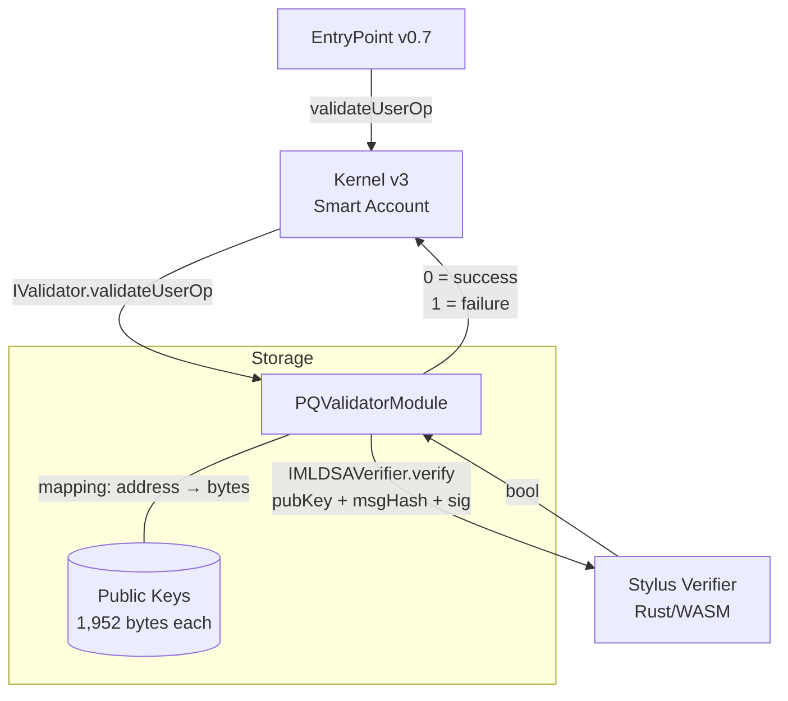

# evm

ERC-7579 validator module for post-quantum smart account authentication. Stores each account's ML-DSA-65 public key and delegates all signature verification to the Stylus contract (`pq-validator/`).

Compatible with any ERC-7579 smart account (Kernel, Safe, Rhinestone). Tested with Kernel v3.

## Architecture



**Data flow**: EntryPoint calls Kernel → Kernel routes to PQValidatorModule (via nonce-encoded validator selection) → module reads stored public key, calls Stylus verifier → result bubbles back up.

## Contracts

| File | Lines | Purpose |
|------|-------|---------|
| `src/PQValidatorModule.sol` | 74 | Validator module: onInstall/onUninstall, validateUserOp, isValidSignatureWithSender (ERC-1271) |
| `src/interfaces/IMLDSAVerifier.sol` | 13 | Interface to the Stylus verifier: `verify(bytes, bytes32, bytes) → bool` |

## Quick Start

```bash
# Build
forge build --root evm/

# Test (15 test cases)
forge test --root evm/ -vvv

# Format check
forge fmt --root evm/ --check
```

## Deployment

**Automated**:
```bash
./scripts/dev-stack.sh  # deploys verifier + module
```

**Manual**:
```bash
# 1. Deploy (requires Stylus verifier address)
BYTECODE=$(jq -r '.bytecode.object' evm/out/PQValidatorModule.sol/PQValidatorModule.json)
ARGS=$(cast abi-encode "constructor(address)" $STYLUS_VERIFIER)
cast send --private-key $PK --rpc-url $RPC --create "${BYTECODE}${ARGS:2}"

# 2. Install on Kernel account (1,952-byte ML-DSA public key as init data)
# Encode installModule(uint256 moduleType, address module, bytes initData)
# moduleType = 1 (validator), initData = raw public key bytes

# 3. Grant selector access for non-root usage
# Kernel.grantAccess(selector, pqModule) for execute(bytes32,bytes)
```

**Kernel integration notes**:
- Non-root validator nonce key: `0x0001{20-byte validator address}0000`
- `verificationGasLimit` must be >= 2M (Stylus verify ~374K + Kernel overhead)
- Kernel must compile with `FOUNDRY_PROFILE=deploy` (via-ir) to stay under 24KB

## Tradeoffs

**Immutable verifier address**: The Stylus contract address is set in the constructor and cannot be changed. Upgrading the verifier means redeploying the module. This avoids governance/proxy complexity but requires migration for upgrades.

**Per-account key storage**: Each smart account stores its own public key (1,952 bytes) in the module's mapping. Simple and isolated, but no shared key registry or rotation mechanism yet.

**No signature transformation**: Raw ML-DSA signatures (3,309 bytes) are passed through to Stylus without any Solidity-side encoding. Keeps the Solidity contract thin but means all 3,309 bytes travel as calldata.

## Production Limitations

- **Mock-based tests**: Unit tests use `vm.mockCall` to stub the Stylus verifier. No in-test Stylus execution — real integration requires a running devnode.
- **No aggregation**: Single-validator, non-aggregated path only. No BLS-style signature aggregation for batching.
- **Verifier upgrade = redeploy**: Immutable verifier address means upgrading ML-DSA implementation requires deploying a new module and migrating all accounts.
- **No key rotation**: Once installed, the public key can only be changed by uninstalling and reinstalling the module.
- **ERC-1271 sender allowlist**: `isValidSignatureWithSender` accepts any sender — no allowlist enforcement yet (see TODO in source).