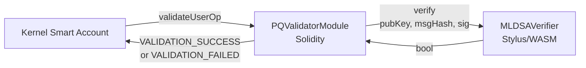

# pq-validator

ML-DSA-65 (FIPS 204) signature verifier deployed as an Arbitrum Stylus contract. Receives a public key, message hash, and signature from the Solidity validator module and returns whether the signature is valid.

Stylus executes Rust/WASM natively on Arbitrum's coprocessor — ML-DSA verification costs ~374K gas here vs. millions in pure EVM.

## Architecture



The contract is **stateless** — public keys are stored in the Solidity module and passed as calldata. This keeps the Stylus side simple and avoids cross-runtime storage complexity.

## Quick Start

**Automated** (deploys everything):
```bash
./scripts/dev-stack.sh
```

**Manual**:
```bash
# Build and run tests
cargo test --package pq-validator

# Check WASM compiles and fits size budget
cargo stylus check --manifest-path pq-validator/Cargo.toml

# Deploy to local devnode
cd pq-validator && cargo stylus deploy \
  --private-key 0xb6b15c8cb491557369f3c7d2c287b053eb229daa9c22138887752191c9520659 \
  --endpoint http://127.0.0.1:8547

# Generate Solidity ABI
cargo run --package pq-validator --features export-abi
```

## Key Numbers

| Metric | Value |
|--------|-------|
| Verification gas | ~374,000 |
| WASM size (raw) | ~20.7 KB |
| WASM size (gzipped) | ~7.8 KB |
| Size limit | 24 KB compressed |
| Public key | 1,952 bytes |
| Signature | 3,309 bytes |
| Message | 32 bytes (keccak256 hash) |

## Tradeoffs

**ml-dsa (RustCrypto) over fips204 (IntegrityChain)**: Faster benchmarks, active maintenance team (Tony Arcieri + Trail of Bits contributors), broader test coverage (ACVP + Wycheproof). fips204 has smaller WASM (12.7 KB) but single maintainer and slower. See `thoughts/shared/research/ml-dsa-library-comparison.md`.

**Stateless design**: No on-chain key storage in Stylus. Avoids cross-runtime storage bugs (Nitro #4114) and keeps the contract a pure function. Tradeoff: public key (1,952 bytes) must be passed as calldata on every verification, adding ~62K gas in calldata costs.

**Stylus over pure EVM**: ML-DSA verification in Solidity would cost millions of gas (lattice polynomial arithmetic is not EVM-friendly). Stylus WASM execution is 10-100x cheaper for crypto operations. Tradeoff: dependency on Arbitrum-specific infrastructure, SDK maturity risks.

## Tests

```bash
cargo test --package pq-validator
```

4 test cases using `stylus_test::TestVM`:
- Valid signature → returns `true`
- Flipped signature byte → returns `false`
- Wrong-length public key → reverts with `InvalidPublicKey`
- Cross-implementation: JS (@noble/post-quantum) signature verified by Rust ml-dsa

## Production Limitations

- **Reactivation required**: Stylus contracts auto-deactivate after 365 days or ArbOS upgrades. Must redeploy or call reactivation.
- **SDK maturity**: Stylus SDK is pre-1.0. Known issues: testing framework segfaults with mappings (#261), cross-contract return data loss (Nitro #4114). See `thoughts/shared/research/stylus-maturity-assessment.md`.
- **WASM size headroom**: ~3.3 KB raw headroom before hitting 24 KB limit. Adding features (multi-level ML-DSA, batch verification) requires size monitoring.
- **No tracing**: `cast run` cannot trace Stylus transactions (OpcodeNotFound). Use `cast call` for on-chain simulation instead.
- **ml-dsa crate is RC**: v0.1.0-rc.7 — not yet stable release. Pin version and test before upgrading.