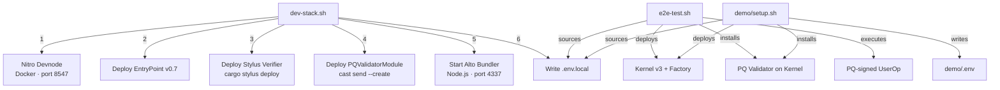

# scripts

Dev stack orchestration and CLI tools for the post-quantum account abstraction system. One command spins up a local Nitro devnode, deploys all contracts (EntryPoint, Stylus verifier, PQ module), and starts the Alto bundler.

## Architecture



## Prerequisites

**Commands** (checked by dev-stack.sh at startup):

| Tool | Purpose |
|------|---------|
| `docker` | Runs Nitro devnode container |
| `cast` / `forge` | Foundry — chain interaction + contract compilation |
| `cargo-stylus` | Deploys WASM contracts to Stylus |
| `node` | Runs Alto bundler |
| `jq` | JSON parsing |
| `curl` | Health checks |
| `python3` | Arithmetic in e2e-test.sh |

**External repos** (expected at `~/Developer/tools/dlt/`):

| Repo | Path | Purpose |
|------|------|---------|
| nitro-devnode | `~/Developer/tools/dlt/nitro-devnode/` | `run-dev-node.sh` starts Docker container |
| alto | `~/Developer/tools/dlt/alto/` | ERC-4337 bundler CLI |
| account-abstraction | `~/Developer/tools/dlt/account-abstraction/` | EntryPoint v0.7 bytecode artifacts |
| kernel | `~/Developer/tools/dlt/kernel/` | Kernel v3 contracts (dev branch) |

## Quick Start

```bash
# Start everything (devnode + contracts + bundler)
./scripts/dev-stack.sh

# Run full E2E test (Kernel + PQ UserOp)
./scripts/e2e-test.sh

# Or just set up the demo environment
./demo/setup.sh
```

## Script Inventory

| Script | What It Does |
|--------|-------------|
| `dev-stack.sh` | Starts devnode, deploys EntryPoint + Stylus verifier + PQ module, starts Alto bundler, writes `.env.local` |
| `e2e-test.sh` | Deploys Kernel, installs PQ validator, generates ML-DSA keypair, signs and submits a PQ UserOp, verifies on-chain |
| `demo/setup.sh` | Subset of e2e-test: deploys Kernel + installs PQ validator, writes `demo/.env` for the WalletConnect demo |
| `spec_metadata.sh` | Collects git metadata (commit, branch, date) for thoughts documents |

## Manual Path

What `dev-stack.sh` does step-by-step:

1. **Preflight**: Checks all required commands exist, Docker is running
2. **Clean state**: Kills stale processes on ports 4337/8547, removes old `nitro-dev` container
3. **Start devnode**: Runs `run-dev-node.sh`, waits for RPC at `localhost:8547`
4. **Deploy EntryPoint v0.7**: Extracts bytecode from account-abstraction artifacts, deploys via `cast send --create`
5. **Deploy Stylus verifier**: `cargo stylus deploy` from `pq-validator/`
6. **Deploy PQ module**: Builds with `forge build`, deploys with `cast send --create` (constructor arg: verifier address)
7. **Fund test accounts**: Sends 10 ETH to three well-known test addresses
8. **Start Alto**: Launches bundler on port 4337 with `--chain-type arbitrum --safe-mode false`
9. **Health checks**: Verifies chain ID, contract code exists, bundler responds
10. **Write `.env.local`**: All deployed addresses + RPC endpoints

Cleanup runs on exit (Ctrl-C or script end): kills bundler, kills devnode, removes Docker container.

## CLI Tools

Build:
```bash
cargo build --release --manifest-path scripts/cli/Cargo.toml
```

| Binary | Usage | Output |
|--------|-------|--------|
| `pq-keygen` | `pq-keygen --output /tmp/keys` | `pk.bin` (1,952 B), `sk.bin` (32 B seed) |
| `pq-sign` | `pq-sign --key sk.bin --hash 0x... --output sig.bin` | `sig.bin` (3,309 B) |
| `pq-verify` | `pq-verify --key pk.bin --hash 0x... --sig sig.bin` | Exit code 0/1 |

## Outputs

| File | Generated By | Contents |
|------|-------------|----------|
| `.env.local` | dev-stack.sh | RPC, bundler URL, chain ID, deployed contract addresses, dev private key |
| `demo/.env` | demo/setup.sh | Same + Kernel account, ML-DSA seed, ECDSA validator, Reown project ID |
| `.dev-stack-logs/` | dev-stack.sh | `devnode.log`, `alto.log` |

## Production Limitations

- **Hardcoded test keys**: Uses well-known dev account private key. Never use these keys on public networks.
- **Local only**: Scripts target `localhost:8547`. No Sepolia/mainnet deployment scripts yet.
- **External repo paths**: Assumes specific directory layout at `~/Developer/tools/dlt/`. Will fail if repos are elsewhere.
- **No idempotency**: Re-running dev-stack.sh kills and redeploys everything. No incremental updates.
- **Gas estimates are conservative**: 2M verification + 2M call gas limits are safe but wasteful. Production should tune these.